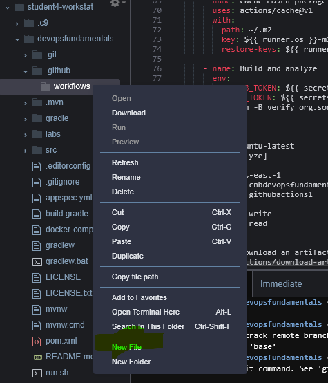
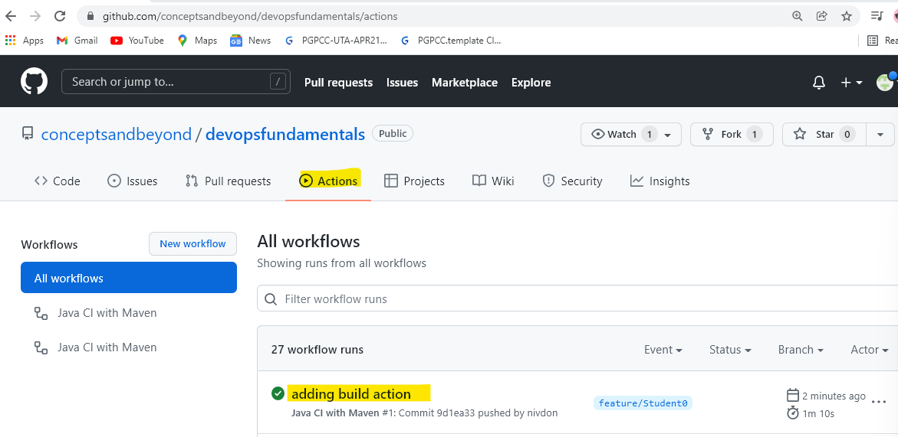
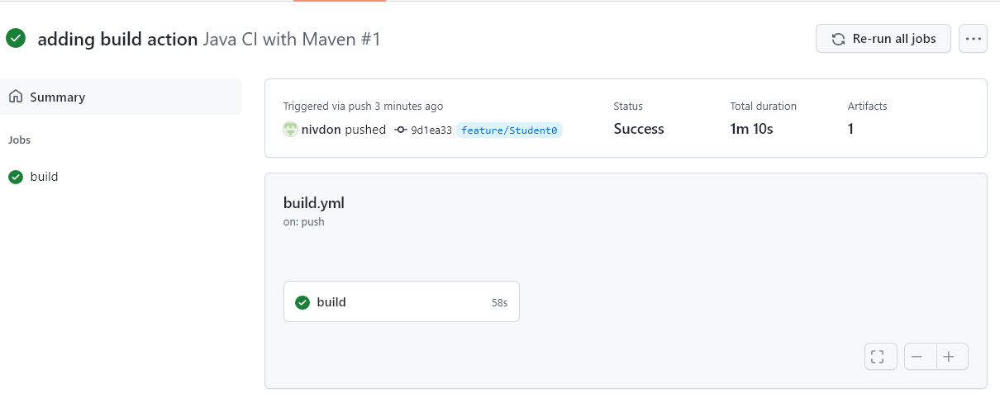
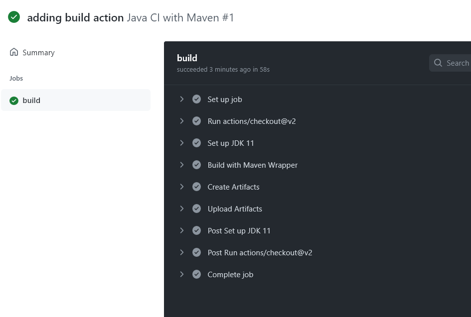

# DevOps Practitioner Lab 1 (~30 minutes)

## Setting up your CI Pipeline using GitHub Actions 

GitHub Actions is a continuous integration and continuous delivery (CI/CD) platform that allows you to automate your build, test, and deployment pipeline. You can create workflows that build and test every pull request to your repository, or deploy merged pull requests to production. 
You can configure a GitHub Actions workflow to be triggered when an event occurs in your repository, such as a pull request being opened or an issue being created. In this example we are going to use a sample JAVA spring boot application and add github actions workflow.


## Create GitHub Actions Workflow
GitHub Actions uses YAML syntax to define the workflow. Each workflow is stored as a separate YAML file in your code repository, in a directory called .github/workflows. Newly created base branch does not have the workflow folders.</n>
<br>
<br>
Following command need to be run in your Cloud9 Environment
1. Start setting up GitHub actions by creating .github/workflow folder. Go to the root of your project directory and run following commands.
```
mkdir .github
cd .github
mkdir workflows
cd workflows
```
2. Create a new yml file ``` build.yml ``` in the folder ``` .github/workflows/ ``` and add the following code. 

3. Right click on workflows folder and click New File

    

Give the name “build.yml” and Double click the file to open it. Copy paste the following content in the file. Please note that the indentation is important. </p>

**build.yml**
```
name: Java CI with Maven

on:
  push:
    branches: [ main, feature/* ]
  pull_request:
    branches: [ main ]

jobs:
  build:

    runs-on: ubuntu-latest
    steps:
      - uses: actions/checkout@v2

      - name: Set up JDK 11
        uses: actions/setup-java@v2
        with:
          java-version: '11'
          distribution: 'adopt'
          cache: maven
  
      - name: Build with Maven Wrapper
        run: ./mvnw clean -B package
        
      - name: Create Artifacts
        run: |
          sudo apt-get install zip
          zip deploy_artifacts.zip target/*.jar appspec.yml run.sh setup.sh stop.sh
          
      - name: Upload Artifacts
        uses: actions/upload-artifact@v2
        with:
          name: jar-file
          path: deploy_artifacts.zip

```         
<mark> <b>Remember to Save the file.</b>

Your new GitHub Actions workflow file is now installed in your repository and will run automatically each time someone pushes a change to the repository. Notice the line 

```
on:
  push:
    branches: [ main, feature/* ]
```
> ***This tells the workflow to trigger on each push on Main and on feature branches.***

```
jobs:
  build:
    runs-on: ubuntu-latest
    steps:
```
> ***Creates the container that runs an ubuntu image where you can run all the tasks that are required to build your application***

```
- name: Build with Maven Wrapper
        run: ./mvnw clean -B package
```
> ***This is the build command that builds our JAVA application and creates the Jar file.***
```
- name: Create Artifacts
```
> ***Steps to create the artifacts that are needed for deploy job***
```
- name: Upload Artifacts
```
> ***Stept to save the artifacts in Github storage to pass to the next  job where we would use them to deploy. sh scripts files contain scripts required for AWS codedeploy to perform deployments.***

Learn more about the syntax of the yaml file [here](https://docs.github.com/en/actions/learn-github-actions/understanding-github-actions)

4. Your first github action workflow is now ready to run. Commit the changes and push.
run following commands in your terminal
```
git add .
git commit -m "adding build action"
git push --set-upstream origin feature/Student0
```
 <span style="color:red">Change the branch name to match with the branch that you created in lab 0.</span>

*you will be prompted for username- enter Student ``` your team number ```
for password enter the Personal access token provided to you*

5. Login to GitHub and open url - <https://github.com/conceptsandbeyond/devopsfundamentals>
6. Click on Actions tab

   

7. you will see the most recent workflow with the commit message that you provided during the git push.

8. Click on the workflow to view your commands.

   

9. You have Successfully created the first github actions with the build job. Go ahead and click on build and explore the logs.

   

10. Move on to the next lab to add the subsequent actions.


