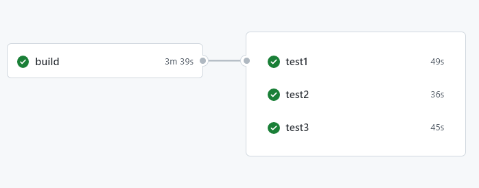

# DevOps Practitioner Lab 2a (~30 minutes)

## Setting up Jobs to run concurrently

  

Add 3 Test jobs to run in parallel after the build phase. Make sure that the Analyze phase runs after all the test jobs are completed
  

   

 

Login to GitHub and open url - <https://github.com/conceptsandbeyond/devopsfundamentals>
Click on Actions tab

Move on to the next lab to add the subsequent actions.

