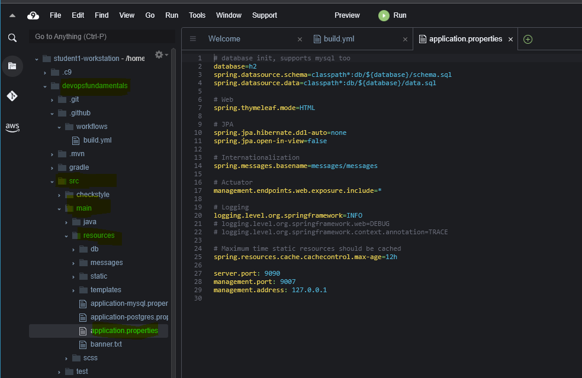
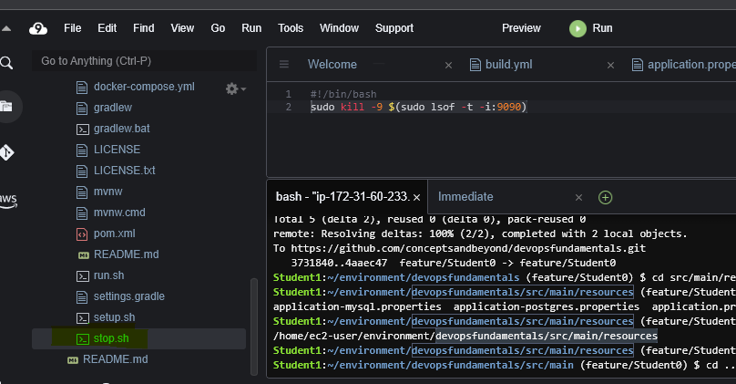
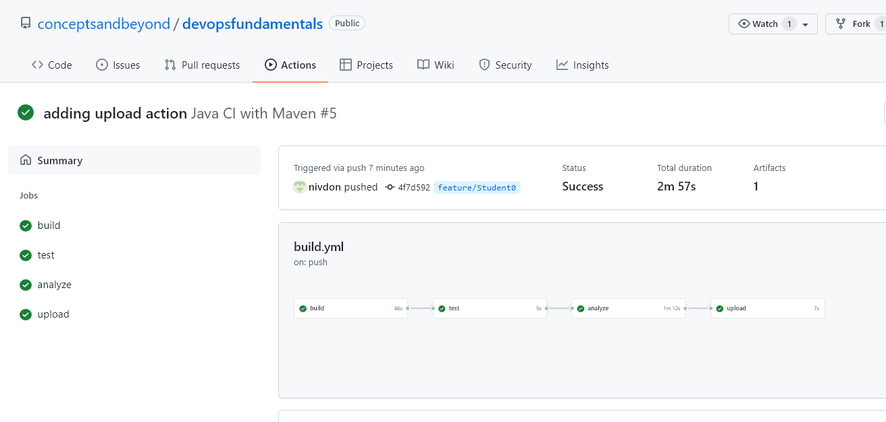
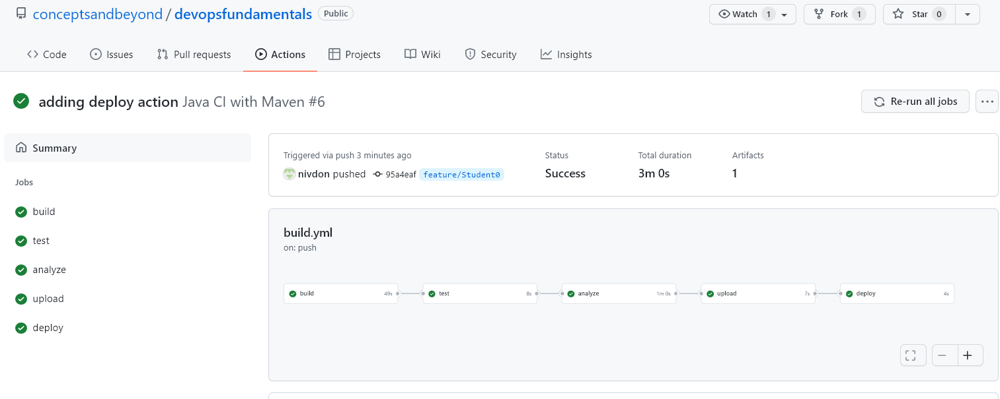
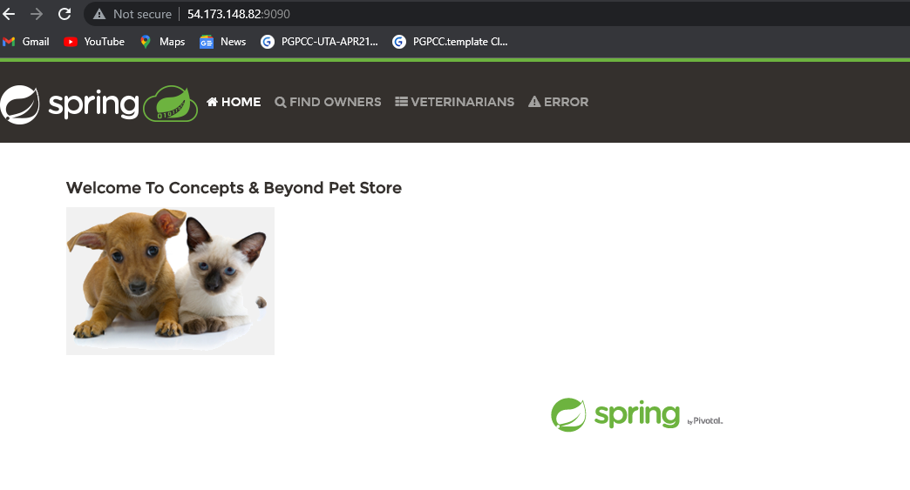

# **DevOps Practitioner Lab 4**
 ## ***Setting up your CD Pipeline using GitHub Actions***
In this lab you will set up the upload and deploy phases for your CICD pipeline. For our demo we will be using S3 as an Artifacts store and Amazon EC2 as deployment server. 

Please Note that this lab is dependent on Lab 1 and Lab 2 and is to be built in continuation. 

Please check - 
* That you are on the feature/Student<your number> branch. 
* That you have created a .github/workflows/build.yml file.
* That you have a successful GitHub Actions workflow run from lab 4.

## **Prepare Application for Deployment**
### **Change the port number.** 
* Open *application.properties file(at devopsfundamentals/src/main/resources)* files as shown below.

    
Change the last digit of ```server.port:9090``` to match with your team number. </P>
i.e. 
  *student1* -  `server.port:9091`</p>
  *student2* - `server.port:9092` </p>
  *student3* -  `server.port:9093`</p>
  *student4* - `server.port:9094` and so on

<br>

* Open Stop.sh at the folder root (*devopsfundamentals*)
Change the port number to the same as in the previous file and to match with your team number</p>
`sudo kill -9 $(sudo lsof -t -i:9090)`</br>
change to </p>
i.e. 
  *student1* -  `sudo kill -9 $(sudo lsof -t -i:9091)` </p>
  *student2* - `sudo kill -9 $(sudo lsof -t -i:9092)` </p>
  *student3* -  `sudo kill -9 $(sudo lsof -t -i:9091)` </p>
  *student4* - `sudo kill -9 $(sudo lsof -t -i:9092)` and so on

    

## **Add Upload Phase**
1. You will now add the upload phase to your pipeline. This phase is optional and can be used to upload your artifacts to the artifacts repository. 
2. In our example we are going to use Amazon S3 to store artifacts. 
3. You will add Following yml code in your .github/workflows/build.yml file
```
upload:
    runs-on: ubuntu-latest
    needs: [analyze]
    env:
      Region: us-east-1
      S3Bucket: cnbdevopsfundamentals
      S3Folder: githubactions<your team number> #change the number to match with your team number
    permissions:
      id-token: write
      contents: read
      
    steps:
      - name: Download an artifact
        uses: actions/download-artifact@v2
        with:
          name: jar-file

      - name: configure AWS credentials
        uses: aws-actions/configure-aws-credentials@v1
        with:
          role-to-assume: arn:aws:iam::286144240398:role/AssumeRoleForGithubUsers
          aws-region: ${{ env.Region }}
          
      - name: deploy to S3
        run: |
          ls
          aws s3 cp *.zip s3://${{ env.S3Bucket }}/${{ env.S3Folder }}/
```

<br>
To avoid any syntax errors with copying, YML files for this lab are provided in the labs folder. </p> Please run the following command to use that file. </p>

```
cd /home/ec2-user/environment/devopsfundamentals
#To make sure you are at project root directory
cp labs/lab4.1-upload.yml .github/workflows/build.yml
# Open your build.yml file and review contents of your files
```

**Open your build.yml file and rename the S3Folder section to match with your number </p> Search for the line** `S3Folder: githubactions0` **and update it with your team number.**
S3Folder: githubactions`<your team number>`</p>

>e.g.</p>
>student1 will have  `S3Folder: githubactions1`</p>
>student2 will have  `S3Folder: githubactions2`</p>
>student3 will have  `S3Folder: githubactions3`</p>
>student4 will have  `S3Folder: githubactions4`</p>

4. Push the code
```
git add .
git commit -m "adding upload action"
git push 
```
>*username - enter your username* </p>
>*password - enter the Personal access token provided to you.*

<br>

5. Check github actions workflow to see the Upload phase added

    


## **Add Deploy Phase**
1. AWS provides virtual servers to host applications.
2. In this phase you can deploy the application to any destination of your choice
 In this example we are going to use AWS CodeDeploy to handle our deployment to Amazon EC2 servers. Open your .github/workflows/build.yml file.
3. You will add the following yml code in your .github/workflows/build.ymlfile.


```
deploy:
    runs-on: ubuntu-latest
    needs: [upload]
    env:
      Region: us-east-1
      S3Bucket: cnbdevopsfundamentals
      S3Folder: githubactions<your team number> #change the number to match with your team number
    permissions:
      id-token: write
      contents: read
      
    steps:
      - name: configure AWS credentials
        uses: aws-actions/configure-aws-credentials@v1
        with:
          role-to-assume: arn:aws:iam::286144240398:role/AssumeRoleForGithubUsers
          aws-region: ${{ env.Region }}
          
          
      - name: CodeDeploy to EC2
        id: deploy
        run: |
          aws deploy create-deployment \
            --application-name CnBDevOpsApp \
            --deployment-group-name CnBDevOpsDG \
            --deployment-config-name CodeDeployDefault.AllAtOnce \
            --s3-location bucket=${{ env.S3Bucket }},bundleType=zip,key=${{ env.S3Folder }}/deploy_artifacts.zip
```

<br>
To avoid any syntax errors with copying, YML files for this lab are provided in the labs folder. </p> Please run the following command to use that file. </p>

```
cd /home/ec2-user/environment/devopsfundamentals
#To make sure you are at project root directory
cp labs/lab4.2-deploy.yml .github/workflows/build.yml
# Open your build.yml file and review contents of your files
```

**Open your build.yml file and rename the S3Folder section to match with your number </p> Search for the line** `S3Folder: githubactions0` **and update it with your team number.**
S3Folder: githubactions`<your team number>`</p>

>e.g.</p>
>student1 will have  `S3Folder: githubactions1`</p>
>student2 will have  `S3Folder: githubactions2`</p>
>student3 will have  `S3Folder: githubactions3`</p>
>student4 will have  `S3Folder: githubactions4`</p>

4. Push the code
```
git add .
git commit -m "adding Deploy action"
git push 
```
>*username - enter your username* </p>
>*password - enter the Personal access token provided to you.*

5. Check github actions workflow to see the Deploy phase added

   

**Congratulations, your application is now deployed.**

from your cloud9 terminal run the following command to get the PublicIP of the deployment server.

`aws ec2 describe-instances --instance-id i-0edaf3625fea3c0bd  --query 'Reservations[*].Instances[*].PublicIpAddress'`

 **you can view it at below url. Change the port number to match with your port number.**

http://54.173.148.82:9090/

  
